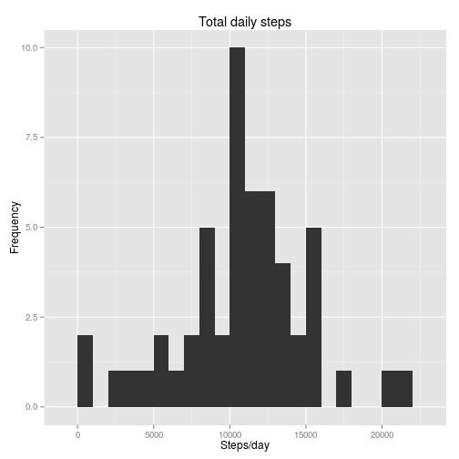
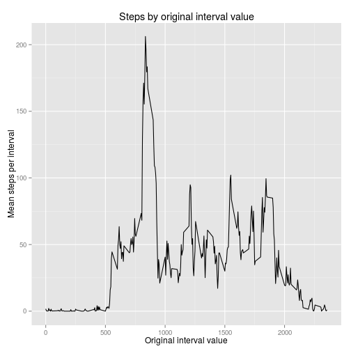

# Reproducible Research: Peer Assessment 1
## Overview
I submit this file as part of Peer Assessment 1 for the Coursera course *Reproducible Research*.

In this exercise, we are asked to answer a series of simple questions about a dataset of personal movement information contained in a github repository. The exercise requires us to use RMarkdown to demonstrate literate programming techniques as part of a general focus on creating analyses which can be easily understood and reproduced by others.

This report is longer than it should be, if the only goal here was to communicate results. I chose to make it longer because I was interested in exploring RMarkdown as a kind of lab notebook for analyses, so I wrote it more in that style, with the idea that the key ideas I had while doing the analysis should be written down, even if some turns turned out to be down blind alleys. I apologize to my peer evaluators for the length, but I'm also doing the course to explore how I can use the ideas in my work. I chose to approach this assignment as writing something for internal lab use than for formal publication.

## The questions
The `README.md` file contains the codebook information for this project. In brief, the data are a convenience sample of activity data (steps in a 5 minute interval) for one individual over a two month period of time. Some of the data are missing.

Given the constraints of the data, the goal of the project is primarily descriptive, and is focused on four basic questions:

* On average, how many steps per day does this person take?
* How does his or her activity vary by time of day?
* Some data are missing. Is this a problem?
* Do activity patterns differ between weekend and non-weekend days?

## Raw data source
The raw dataset comes from Roger Peng's [RepData_Peer Assessment1 github repository](https://github.com/rdpeng/RepData_PeerAssessment1).
I cloned his commit with ID 80edf39c3bb508fee88e3394542f967dd3fd3270 on October 5, 2015.

## Processing environment
Processing is done in the following R environment:

```r
require('dplyr')
```

```
## Loading required package: dplyr
## 
## Attaching package: 'dplyr'
## 
## The following objects are masked from 'package:stats':
## 
##     filter, lag
## 
## The following objects are masked from 'package:base':
## 
##     intersect, setdiff, setequal, union
```

```r
require('ggplot2')
```

```
## Loading required package: ggplot2
```

```r
require('lubridate')
```

```
## Loading required package: lubridate
```

```r
sessionInfo()
```

```
## R version 3.2.2 (2015-08-14)
## Platform: x86_64-pc-linux-gnu (64-bit)
## Running under: Ubuntu 15.04
## 
## locale:
##  [1] LC_CTYPE=en_US.UTF-8       LC_NUMERIC=C              
##  [3] LC_TIME=en_US.UTF-8        LC_COLLATE=en_US.UTF-8    
##  [5] LC_MONETARY=en_US.UTF-8    LC_MESSAGES=en_US.UTF-8   
##  [7] LC_PAPER=en_US.UTF-8       LC_NAME=C                 
##  [9] LC_ADDRESS=C               LC_TELEPHONE=C            
## [11] LC_MEASUREMENT=en_US.UTF-8 LC_IDENTIFICATION=C       
## 
## attached base packages:
## [1] stats     graphics  grDevices utils     datasets  methods   base     
## 
## other attached packages:
## [1] lubridate_1.3.3 ggplot2_1.0.1   dplyr_0.4.3    
## 
## loaded via a namespace (and not attached):
##  [1] Rcpp_0.12.1      knitr_1.11       magrittr_1.5     MASS_7.3-44     
##  [5] munsell_0.4.2    colorspace_1.2-6 R6_2.1.1         stringr_1.0.0   
##  [9] plyr_1.8.3       tools_3.2.2      parallel_3.2.2   grid_3.2.2      
## [13] gtable_0.1.2     DBI_0.3.1        htmltools_0.2.6  yaml_2.1.13     
## [17] assertthat_0.1   digest_0.6.8     reshape2_1.4.1   formatR_1.2.1   
## [21] memoise_0.2.1    evaluate_0.8     rmarkdown_0.8    stringi_0.5-5   
## [25] scales_0.3.0     proto_0.3-10
```

I set the following global options to `knitr` so that copies of all figures go into the `figure/` directory.


```r
knitr::opts_chunk$set(fig.path='figure/')
```

## Loading and preprocessing the data
The cloned repository contains the raw data in a zip file in the root directory of the repository called `activity.zip`. The R working directory is set to this root directory.

The following code unzips `activity.csv` from the `activity.zip` file into the working directory and reads `activity.csv` into an R data frame `rawData`: 


```r
unzip("activity.zip")
rawData <- read.csv("activity.csv")
```

The structure of the data frame matches the description in `README.md`.
.

```r
str(rawData)
```

```
## 'data.frame':	17568 obs. of  3 variables:
##  $ steps   : int  NA NA NA NA NA NA NA NA NA NA ...
##  $ date    : Factor w/ 61 levels "2012-10-01","2012-10-02",..: 1 1 1 1 1 1 1 1 1 1 ...
##  $ interval: int  0 5 10 15 20 25 30 35 40 45 ...
```

These data are "tidy" in the sense described by [Hadley Wickham](http://www.jstatsoft.org/article/view/v059i10).
However, there are at least two oddities here. First, the `date` variable is read in as a factor, rather than a Date, so it needs to be converted to a Date. The other oddity can be seen in the following output.


```r
head(rawData$interval, 32)
```

```
##  [1]   0   5  10  15  20  25  30  35  40  45  50  55 100 105 110 115 120
## [18] 125 130 135 140 145 150 155 200 205 210 215 220 225 230 235
```

It appears that the value of `interval` is

`interval = (hour * 100) + minutes`.

This is likely to make any plots based on `interval` somewhat difficult to interpret. I think it makes much more sense to define a new variable, `minute`, defined as

`minute = 5 * row`,

where `row` is the index of the row.

Wickam's [`dplyr`](https://github.com/hadley/dplyr) package provides a concise and powerful"Grammar of Data Manipulation" which is useful for answering the questions, so I use this library and create the analyticData dataframe with `date` recoded from a factor to a Date.


```r
analyticData <- transmute(tbl_df(rawData), steps=steps, date=ymd(date), interval=interval)
```
For convenience, `dplyr` provides a tbl_df wrapper for dataframes. This wrapper makes for prettier printing of dataframes, so I used it here. `ymd` is a date-parser from the `lubridate` package.

Now, we just add another variable, `minute`, to `analyticData` which is simply just the number of minutes past midnight.


```r
analyticData$minute <- seq(from = 0, to = 1435, by=5)
```

and we will use `minute`, not `interval`, for most plots.

## What is mean total number of steps taken per day?
We begin by calculating the total number of steps taken each day, ignoring the missing values.


```r
stepsPerDay <- analyticData %>% group_by(date) %>% summarize(totalSteps=sum(steps))
```

We get the mean and median from R's `summary` function, 


```r
summary(stepsPerDay$totalSteps)
```

```
##    Min. 1st Qu.  Median    Mean 3rd Qu.    Max.    NA's 
##      41    8841   10760   10770   13290   21190       8
```

which gives us valus for the mean and median of `totalSteps` of about 11000 per day.

For graphics, I use the `ggplot2` library. We begin with a very simple barchart of total steps by day.


```r
qplot(date, totalSteps, data=stepsPerDay, geom="bar", stat="identity") +
    labs(title="Steps by date", x="Date", y="Total daily steps")
```

```
## Warning: Removed 8 rows containing missing values (position_stack).
```

 

It is clear that the warning from 8 days are completely missing, which is as expected from the `summary` output.

We're most interested in the total steps per day, so we compute a histogram.


```r
qplot(totalSteps, data=stepsPerDay, geom = "histogram", binwidth=1000) +
     labs(title="Total daily steps", x="Steps/day", y="Frequency")
```

 

The histogram suggests significant variation in the number of steps per day, but we cannot yet distinguish whether this is because of true variation by day or just because some days have a lot of missing data.

## What is the average daily activity pattern?
You would not expect that steps within a 5 minute interval within the day would be uniform. If nothing else, a person is unlikely to be stepping while sleeping unless they are sleepwalking. So, we regroup and resummarize the data, this time by time of day--the number of minutes past midnight--rather than by `date`.


```r
stepsPer5MinuteInterval <- analyticData %>% group_by(minute) %>% summarize(meanSteps=mean(steps, na.rm=TRUE))
```

and plot `meanSteps` by `minute`.


```r
qplot(minute, meanSteps, data=stepsPer5MinuteInterval, geom="line", stat="identity") +
    labs(title="Steps by time of day", x="Minutes past midnight", y="Mean steps in 5 min interval")
```

 

Translating minutes past midnight into hours, it looks like this person wakes up about 400 minutes into the day--about 6:30am--and goes to sleep around 1400 minutes into the day--about 11:30pm. Both of these values are in line with what we might expect. Note how much better this plot looks compared with this next one using `interval` as the x variable. 


```r
stepsPerOriginalInterval <- analyticData %>% group_by(interval) %>% summarize(meanSteps=mean(steps, na.rm=TRUE))
qplot(interval, meanSteps, data=stepsPerOriginalInterval, geom="line", stat="identity") +
    labs(title="Steps by original interval value", x="Original interval value", y="Mean steps per interval")
```

 

The artifactual jumps in the "Steps by orginal interval value" plot are easily seen.

One prominent feature of the previous "Steps by time of day" plot is the big peak at around 500 minutes. We find which interval corresponds to this peak.


```r
stepsPer5MinuteInterval[which.max(stepsPer5MinuteInterval$meanSteps),]
```

```
## Source: local data frame [1 x 2]
## 
##   minute meanSteps
##    (dbl)     (dbl)
## 1    515  206.1698
```

So the max occurs at 515 minutes into the day, or about 8:30 am. Perhaps the subject tends to jog after arising.

Just for comparison with the original interval value, we can also compute


```r
stepsPerOriginalInterval[which.max(stepsPerOriginalInterval$meanSteps),]
```

```
## Source: local data frame [1 x 2]
## 
##   interval meanSteps
##      (int)     (dbl)
## 1      835  206.1698
```

This squares with the result using `minute` since the original `interval` value of 835 decodes to 8:35am.

However, we still have the same problem with the answer to this question as to the last: we don't know whether some of these trends may be suspect because of missing data.

## Imputing missing values
We have already seen that we completely lack data for 8 days. How much of the data are not there?


```r
sum(is.na(analyticData$steps))*100/length(analyticData$steps)
```

```
## [1] 13.11475
```

So, we are missing about 13% of the data values. One quick and dirty way to estimate what the missing data should have been would be to replace missing values by the mean value for that time of day computed over the data we have.

First, we define our imputation function:


```r
impute <- function (steps, minute) {
    if (is.na(steps)) {
        # note that stepsPer5MinuteInterval is a global in the current environment.
        return (stepsPer5MinuteInterval$meanSteps[stepsPer5MinuteInterval$minute == minute])
    } else {
        return (steps)
    }
}
```

`impute` leaves `steps` alone if it isn't `NA`. If it is `NA`, then `impute` replaces steps by the average number of steps per 5 minute interval in that particular interval in `analyticData`.

Then, we use `mapply` to map `impute` over the `analyticData`.


```r
imputedData <- analyticData
imputedData$steps<-mapply(impute, analyticData$steps, analyticData$minute)
```

We check `imputedData` for missing values:


```r
sum(is.na(imputedData$steps))
```

```
## [1] 0
```

Again we calculate the total number of steps taken each day, this time in the imputed data


```r
stepsPerDayImputed <- imputedData %>% group_by(date) %>% summarize(totalSteps=sum(steps))
```

We get the mean and median from R's `summary` function 


```r
summary(stepsPerDayImputed$totalSteps)
```

```
##    Min. 1st Qu.  Median    Mean 3rd Qu.    Max. 
##      41    9819   10770   10770   12810   21190
```

which gives us a value for the mean and median of `totalSteps` of about 11000 per day, just as before.

Again, we look at the barchart of total steps by day.


```r
qplot(date, totalSteps, data=stepsPerDayImputed, geom="bar", stat="identity") +
    geom_hline(aes(yintercept=totalSteps[1]), color="red") +
    labs(title="Steps by date (imputed)", x="Date", y="Total daily steps")
```

 

The days which had no data now have the same value imputed to them (note for example, the first and last days of the series). The first day's data is completely imputed, so the red line shows how many steps we expected on a day in which we had no data. If you examine this plot closely, you can identify all 8 of the days that had no data.

We're most interested in the total steps per day, so we compute a histogram from the imputed data.


```r
qplot(totalSteps, data=stepsPerDayImputed, geom = "histogram", binwidth=1000) +
     labs(title="Total daily steps (imputed)", x="Steps/day", y="Frequency")
```

 

The difference between this and the original histogram is barely noticable.

Just for fun, we re-compute the daily activity pattern for the imputed data, 


```r
stepsPer5MinuteIntervalImputed <- imputedData %>% group_by(minute) %>% summarize(meanSteps=mean(steps, na.rm=TRUE))
```

and plot `meanSteps` by `minute` for that same data.


```r
qplot(minute, meanSteps, data=stepsPer5MinuteIntervalImputed, geom="line", stat="identity") +
    labs(title="Steps by time of day (imputed)", x="Minutes past midnight", y="Mean steps in 5 min interval")
```

 

Not only does this daily activity plot from the imputed data look a lot like the same plot from the analytic data, a short calculation shows that, up to rounding error, `stepsPer5MinuteIntervalImputed$steps` and `stepsPer5MinuteInterval$steps` are virtually the same.


```r
sum((stepsPer5MinuteInterval$steps - stepsPer5MinuteIntervalImputed$steps)^2)
```

```
## [1] 0
```

 This is not unexpected, and comes from the choice of imputation function. What happens is that, for a given 5 minute interval, we compute the mean value of steps during that interval. Imputation then replaces all the `NA` values with the mean. When we then recompute the mean, we have padded out the list of original values which were not `NA` with a bunch of additional values, all of which are the same as the mean of the original list of values. It is not hard to prove (using the usual formula for the weighted mean) that padding the original list of values this way does not change the mean.

Imputation has made next to no difference to any of our previous answers, suggesting that missing data is not somehow skewing our answers. 

## Are there differences in activity patterns between weekdays and weekends?

Since there doesn't seem to be much difference between the analytic data and the imputed data, we will just continue with the analytic data and add a new variable, `weekend`, which indicates whether a given day is a weekend day or not.


```r
augmentedAnalyticData <- mutate(analyticData, weekend = ((wday(date) == 1) | (wday(date) == 7)))
```

The preceeding code makes more sense when you know that the `wday` function from the `lubridate` package returns a number corresponding to the day of the week where Sunday is 1 and Saturday is 7. `weekend = TRUE` for Saturdays and Sundays, but false otherwise.

Next, we summarize this data frame.


```r
stepsPer5MinuteIntervalAugmented <- augmentedAnalyticData %>% group_by(weekend, minute) %>% summarize(meanSteps=mean(steps, na.rm=TRUE))
```

and plot it with different color lines for weekend vs.non-weekend days.


```r
ggplot(stepsPer5MinuteIntervalAugmented, aes(x=minute, y=meanSteps, color=weekend)) +
    geom_line() +
    labs(title="Steps by time of day (weekend vs non-weekend)", x="Minutes past midnight", y="Mean steps in 5 min interval")
```

 

These data suggest that the individual tends to wake up later on the weekends and gets less exercise in the morning on these days. Also, there doesn't seem to much difference in bedtime between weekend and non-weekend days.
